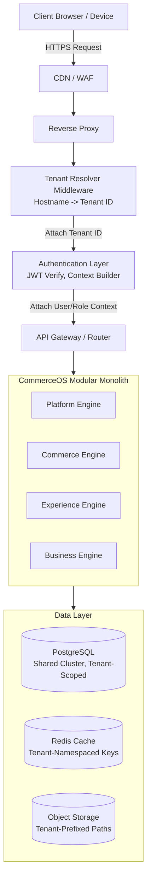
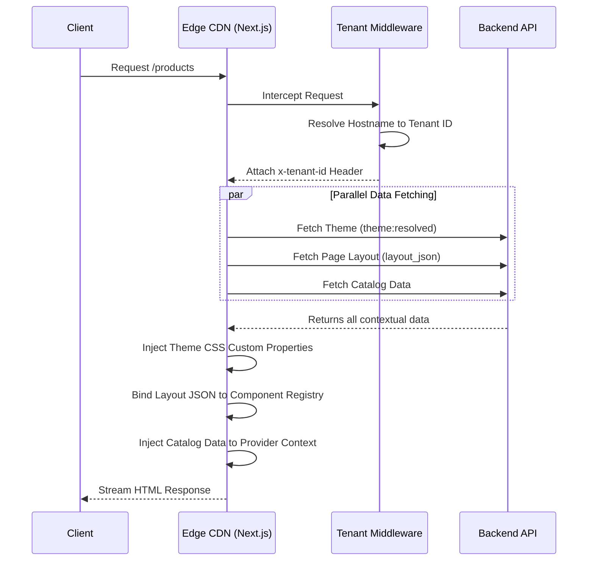
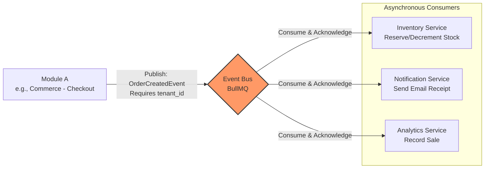

# System Design Diagrams

This document visualizes the core architecture flows described in `02-architecture/01-system-architecture.md`.

## 1. High-Level Request Flow

This diagram illustrates the journey of a client request through the system, emphasizing the strict multi-tenant boundaries and resolution mechanisms.

## 2. Storefront Single-Pass Rendering Pipeline

To guarantee ultra-fast performance, the Next.js storefront fetches data concurrently and renders the component tree in a single SSR pass.

## 3. Event-Driven Backbone

This diagram shows how side effects are handled securely across module boundaries using a tenant-scoped event bus. 

