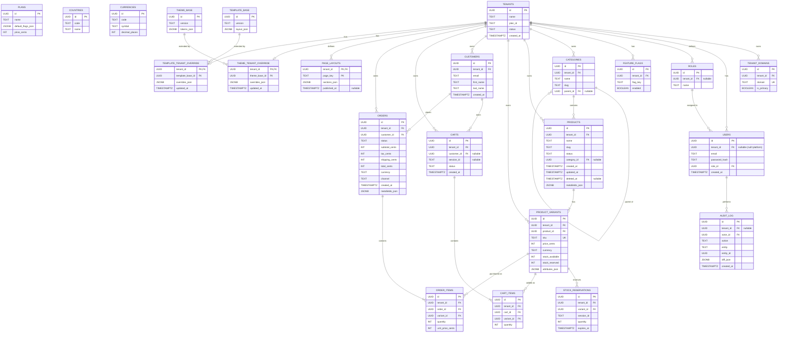

# Database Entity-Relationship Diagram

This diagram maps the Phase 1 Database Schema exactly as specified in `14-data-contracts/01-phase1-entities.md`.

## Phase 1 ERD

```mermaid
erDiagram
    %% PLATFORM & GLOBAL ENTITIES
    PLANS {
        UUID id PK
        TEXT name
        JSONB default_flags_json
        INT price_cents
    }
    
    COUNTRIES {
        UUID id PK
        TEXT code
        TEXT name
    }
    
    CURRENCIES {
        UUID id PK
        TEXT code
        TEXT symbol
        INT decimal_places
    }

    TENANTS {
        UUID id PK
        TEXT name
        TEXT plan_id
        TEXT status
        TIMESTAMPTZ created_at
    }

    TENANT_DOMAINS {
        UUID id PK
        UUID tenant_id FK
        TEXT domain UK
        BOOLEAN is_primary
    }

    USERS {
        UUID id PK
        UUID tenant_id FK "nullable (null=platform)"
        TEXT email
        TEXT password_hash
        UUID role_id FK
        TIMESTAMPTZ created_at
    }

    ROLES {
        UUID id PK
        UUID tenant_id FK "nullable"
        TEXT name
    }

    FEATURE_FLAGS {
        UUID id PK
        UUID tenant_id FK
        TEXT flag_key
        BOOLEAN enabled
    }

    AUDIT_LOG {
        UUID id PK
        UUID tenant_id FK "nullable"
        UUID actor_id FK
        TEXT action
        TEXT entity
        UUID entity_id
        JSONB diff_json
        TIMESTAMPTZ created_at
    }

    %% COMMERCE ENTITIES
    CATEGORIES {
        UUID id PK
        UUID tenant_id FK
        TEXT name
        TEXT slug
        UUID parent_id FK "nullable"
    }

    PRODUCTS {
        UUID id PK
        UUID tenant_id FK
        TEXT name
        TEXT slug
        TEXT status
        UUID category_id FK "nullable"
        TIMESTAMPTZ created_at
        TIMESTAMPTZ updated_at
        TIMESTAMPTZ deleted_at "nullable"
        JSONB metafields_json
    }

    PRODUCT_VARIANTS {
        UUID id PK
        UUID tenant_id FK
        UUID product_id FK
        TEXT sku UK
        INT price_cents
        TEXT currency
        INT stock_available
        INT stock_reserved
        JSONB attributes_json
    }
    
    STOCK_RESERVATIONS {
        UUID id PK
        UUID tenant_id FK
        UUID variant_id FK
        TEXT session_id
        INT quantity
        TIMESTAMPTZ expires_at
    }

    CUSTOMERS {
        UUID id PK
        UUID tenant_id FK
        TEXT email
        TEXT first_name
        TEXT last_name
        TIMESTAMPTZ created_at
    }

    CARTS {
        UUID id PK
        UUID tenant_id FK
        UUID customer_id FK "nullable"
        TEXT session_id "nullable"
        TEXT status
        TIMESTAMPTZ created_at
    }

    CART_ITEMS {
        UUID id PK
        UUID tenant_id FK
        UUID cart_id FK
        UUID variant_id FK
        INT quantity
    }

    ORDERS {
        UUID id PK
        UUID tenant_id FK
        UUID customer_id FK
        TEXT status
        INT subtotal_cents
        INT tax_cents
        INT shipping_cents
        INT total_cents
        TEXT currency
        TEXT channel
        TIMESTAMPTZ created_at
        JSONB metafields_json
    }

    ORDER_ITEMS {
        UUID id PK
        UUID tenant_id FK
        UUID order_id FK
        UUID variant_id FK
        INT quantity
        INT unit_price_cents
    }

    %% EXPERIENCE ENTITIES
    THEME_BASE {
        UUID id PK
        TEXT version
        JSONB tokens_json
    }

    THEME_TENANT_OVERRIDE {
        UUID tenant_id PK,FK
        UUID theme_base_id FK
        JSONB overrides_json
        TIMESTAMPTZ updated_at
    }
    
    TEMPLATE_BASE {
        UUID id PK
        TEXT version
        JSONB layout_json
    }

    TEMPLATE_TENANT_OVERRIDE {
        UUID tenant_id PK,FK
        UUID template_base_id FK
        JSONB overrides_json
        TIMESTAMPTZ updated_at
    }

    PAGE_LAYOUTS {
        UUID tenant_id PK,FK
        TEXT page_key PK
        JSONB sections_json
        TIMESTAMPTZ published_at "nullable"
    }

    %% RELATIONSHIPS
    TENANTS ||--o{ TENANT_DOMAINS : "owns"
    TENANTS ||--o{ USERS : "has"
    TENANTS ||--o{ ROLES : "defines"
    TENANTS ||--o{ FEATURE_FLAGS : "has"
    TENANTS ||--o{ CATEGORIES : "owns"
    TENANTS ||--o{ PRODUCTS : "owns"
    TENANTS ||--o{ PRODUCT_VARIANTS : "owns"
    TENANTS ||--o{ CUSTOMERS : "owns"
    TENANTS ||--o{ CARTS : "owns"
    TENANTS ||--o{ ORDERS : "owns"
    TENANTS ||--o{ PAGE_LAYOUTS : "defines"
    TENANTS ||--o| THEME_TENANT_OVERRIDE : "has"
    TENANTS ||--o| TEMPLATE_TENANT_OVERRIDE : "has"
    
    ROLES ||--o{ USERS : "assigned to"
    USERS ||--o{ AUDIT_LOG : "performs"
    
    CATEGORIES ||--o{ CATEGORIES : "parent of"
    CATEGORIES ||--o{ PRODUCTS : "contains"
    
    PRODUCTS ||--|{ PRODUCT_VARIANTS : "has"
    PRODUCT_VARIANTS ||--o{ STOCK_RESERVATIONS : "reserves"
    PRODUCT_VARIANTS ||--o{ CART_ITEMS : "added as"
    PRODUCT_VARIANTS ||--o{ ORDER_ITEMS : "purchased as"
    
    CUSTOMERS ||--o{ CARTS : "owns"
    CUSTOMERS ||--o{ ORDERS : "places"
    
    CARTS ||--|{ CART_ITEMS : "contains"
    ORDERS ||--|{ ORDER_ITEMS : "contains"
    
    THEME_BASE ||--o{ THEME_TENANT_OVERRIDE : "extended by"
    TEMPLATE_BASE ||--o{ TEMPLATE_TENANT_OVERRIDE : "extended by"

```
